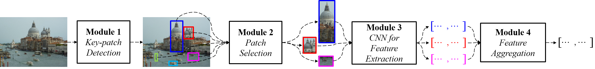
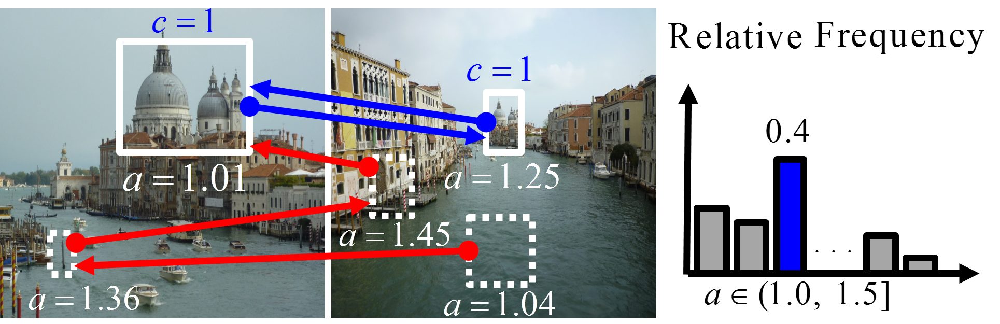

# Discriminatively-learned global image representation using CNN as a local feature extractor for image retrieval

## Paper Pipeline and Key Idea

Take a look at the following pipeline and please refer to paper for more detail.

## Paper Citation

Please cite the following if you find this work helpful.

    @inproceedings{DBLP:conf/vcip/KuCP15,
      author    = {Wei{-}Lin Ku and
                   Hung{-}Chun Chou and
                   Wen{-}Hsiao Peng},
      title     = {Discriminatively-learned global image representation using {CNN} as
                   a local feature extractor for image retrieval},
      booktitle = {2015 Visual Communications and Image Processing, {VCIP} 2015, Singapore,
                   December 13-16, 2015},
      pages     = {1--4},
      year      = {2015},
      crossref  = {DBLP:conf/vcip/2015},
      url       = {https://doi.org/10.1109/VCIP.2015.7457829},
      doi       = {10.1109/VCIP.2015.7457829},
    }

## License and Citation

Caffe is released under the [BSD 2-Clause license](https://github.com/BVLC/caffe/blob/master/LICENSE).
The BVLC reference models are released for unrestricted use.

Please cite Caffe in your publications if it helps your research:

    @article{jia2014caffe,
      Author = {Jia, Yangqing and Shelhamer, Evan and Donahue, Jeff and Karayev, Sergey and Long, Jonathan and Girshick, Ross and Guadarrama, Sergio and Darrell, Trevor},
      Journal = {arXiv preprint arXiv:1408.5093},
      Title = {Caffe: Convolutional Architecture for Fast Feature Embedding},
      Year = {2014}
    }
